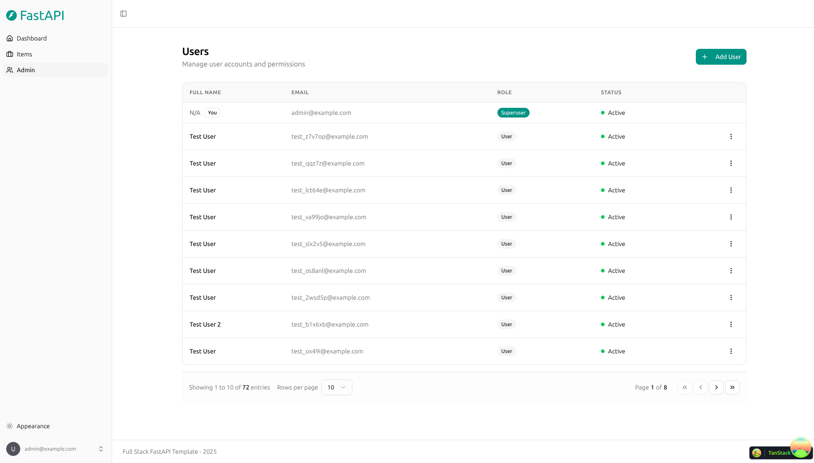

# Inference Matrix

**OpenAI-compatible inference broker for local GGUF models, with a
hardware-local provider architecture and a full admin WebUI.**

Inference Matrix routes OpenAI-compatible requests to inference backends
(llama.cpp, halogen, halogen-flash, gufo) running on one or more
machines, scheduling boot/shutdown around VRAM capacity and tracking
conversations server-side. The admin is a single container; each provider
instance is a hardware-local container that owns exactly one backend.



## How it works

```
Client ──/v1──▶ Admin (FastAPI + litellm + Redis + Postgres)
                  │  scheduler: FIFO + VRAM admission
                  │  WS commands ↓ / events ↑
                  ▼
              Provider instance (owns 1 backend, serves spec-clean /v1 on :8081)
                  ▼
              llama-server / halogen / halogen-flash / gufo
```

- **Admin** — client-facing API, conversation store, scheduler, provider
  registry, and the admin UI. Drives inference with the
  [litellm](https://litellm.ai) SDK and knows nothing provider-specific.
- **Provider instance** — hardware-local. Boots/monitors/stops its
  backend, normalizes the backend's API to the OpenAI/OpenResponses spec
  on its own port, and streams metrics/logs/events to the admin over a
  WebSocket it dials itself (works behind NAT).
- **Machine** — a host pre-registered in the admin with a UID and VRAM
  capacity; the scheduler uses it to avoid over-provisioning.

See **[ARCHITECTURE.md](ARCHITECTURE.md)** for the full design and
**[docs/ws-protocol.md](docs/ws-protocol.md)** for the admin ⇄ provider
protocol.

## Public API

| Endpoint | Status |
| --- | --- |
| `POST /v1/responses` | Supported — streaming + non-streaming, `previous_response_id` chaining, tools |
| `POST /v1/chat/completions` | Planned (Phase 7) |
| `GET /v1/models` | Planned (Phase 7) — from provider definitions |
| `GET /` | Swagger UI |
| `GET /openapi.json` | OpenAPI schema |

Other OpenAI endpoints (embeddings, legacy completions, files, batches,
audio, rerank, moderations, decisions) currently return `501 Not
Implemented` — see Accepted Regressions in
[IMPLEMENTATION_STATUS.md](IMPLEMENTATION_STATUS.md).

## Quick start (local, no hardware)

Requires [Docker Compose](https://docs.docker.com/compose/) and
[Bun](https://bun.sh/).

```bash
# Bring up postgres + redis + admin + mock provider
docker compose up -d --build

# Admin UI        -> http://localhost:8000/admin
# Swagger UI      -> http://localhost:8000/
# OpenAPI schema  -> http://localhost:8000/openapi.json
```

The stack starts empty: the mock provider cannot register until a Machine
(uid `mock-machine-1`) and a `mock` ProviderDefinition (registration token
`mock-registration-token`) exist. Create them via the admin UI once
Machine/Definition CRUD lands (Phase 10); until then, seed with a `psql`
insert (see development.md § Seeding for a ready-made snippet), then
restart the mock provider container:

```bash
docker compose restart provider-mock
```

```bash
curl -N http://localhost:8000/v1/responses \
  -H 'Content-Type: application/json' \
  -d '{"model": "<your-mock-alias>", "input": "Hello!", "stream": true}'
```

The mock provider exercises the entire real path — registration, WebSocket,
scheduler, VRAM admission, boot handshake, litellm, SSE, persistence —
with zero GPU.

## Repository layout

```
admin/
  backend/    FastAPI admin + public inference API (uv package: matrix-admin)
  frontend/   React + Bun + TanStack Router UI (served under /admin)
provider/
  lib/        Shared provider library (registration, WS, lifecycle, metrics)
  mock/       Mock provider (hardware-free development + tests)
  llama-cpp/  llama.cpp provider
  halogen/ halogen-flash/ gufo/   (pending, Phase 8)
docs/         ws-protocol.md, integration-testing.md
legacy/       Pre-overhaul code (reference only)
```

## Development

See **[development.md](development.md)** for local setup (backend,
frontend, tests, client generation) and **[deployment.md](deployment.md)**
for production. Agent-facing commands and conventions live in
**[AGENTS.md](AGENTS.md)**.

## License

MIT — see [LICENSE](LICENSE).
